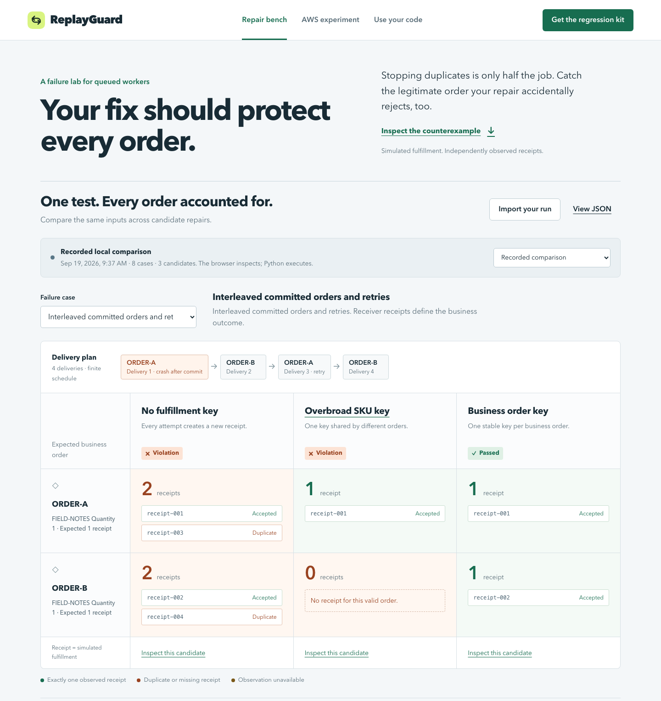

# ReplayGuard

**A retry repair should protect every order.**

[Live lab](https://prod.d2w687q4ucx6dk.amplifyapp.com) · [Watch the 2:43 demo](https://youtu.be/CGE19upS66A) · [Download the regression kit](web/replayguard-repair-lab.zip)

A worker fulfills an order, crashes, and retries. Adding an idempotency key can stop the duplicate—but a key that is too broad can also reject the next legitimate order. ReplayGuard checks both outcomes: **one correct receipt for each valid business order**.

The project began with a real Lambda/SQS failure-and-repair experiment on September 18, 2026. The current repair bench runs trusted Python adapters locally, injects a crash after simulated fulfillment commits, independently observes receipts, and exports a runnable regression case. The comparison makes duplicate, missing, and incorrect fulfillment visible per order.



In the interleaved-retries case, two valid orders share a SKU. Each should have one receipt:

| Candidate | Order A receipts | Order B receipts | Result |
| --- | ---: | ---: | --- |
| No key | 2 | 2 | Violation: duplicate fulfillment |
| SKU key | 1 | 0 | Violation: a valid order is suppressed |
| Business order key | 1 | 1 | Passed for this case |

These counts come from [executed local evidence](web/repair-example.json). The handler's return value cannot supply receipt truth.

## Run, change a repair, inspect the result

Use the source folder or extract the [portable regression kit](web/replayguard-repair-lab.zip). Requires **Python 3.11+ on macOS or Linux**. The kit needs no packages, credentials, or network.

```sh
# Compare all three candidates across all eight cases.
python3 -I -S scripts/test_repair.py --output repair-results.json

# A compact passing repair example.
python3 -I -S scripts/test_repair.py \
  --candidate business-key --case crash-retry --output repaired.json
```

The first command intentionally exits **3**: the full plan contains an unsupported-effect control. It also includes faulty candidates and a missing-observation control. This is the aggregate business result, not a claim that every expected test outcome should be green. The business-key candidate passes all six supported, observed reference cases.

| Exit | State | Meaning |
| --- | --- | --- |
| `0` | Passed | Required effects and delivery outcomes held for the declared case. |
| `1` | Violation | An observed business invariant or required rejection was broken. |
| `2` | Incomplete | Required execution, observation, or fault evidence is missing. |
| `3` | Unresolved | The effect contract is unsupported or a local guard boundary was crossed. |

Aggregate precedence is unresolved, violation, incomplete, passed. A missing snapshot is unknown, never an empty ledger.

Start the comparison locally:

```sh
python3 -m http.server 8088 --bind 127.0.0.1 --directory web
```

Open [127.0.0.1:8088](http://127.0.0.1:8088), select a case, inspect each candidate's receipts and delivery trace, then import your generated report. The new [index page](web/index.html) is the repair bench; [recorded-lab.html](web/recorded-lab.html) preserves the original comparison. The browser recomputes results from inputs and observations, rejects contradictory claims, and preserves the original imported bytes. It does not execute Python or authenticate report origin.

## Connect your own worker

Keep the adapter and any sibling Python source in a dedicated small directory. Export `build(effects)`, returning a callable handler:

```python
def build(effects):
    def handle(delivery):
        order = delivery["order"]
        return effects.fulfill(order, key=order["orderId"])
    return handle
```

The harness supplies deliveries and faults; the adapter chooses its key. The receiver atomically commits or reuses a receipt and rejects a conflicting payload. The fault occurs immediately after a new receipt commits, before the fulfillment response returns. Expected inputs, finite delivery schedules, assertions, receipt evidence, and captured source hashes travel in the report. See the [adapter contract](docs/repair-lab/adapter.md) and [schema](docs/repair-lab/schema.md).

Run the independent DispatchDesk example from this source repository:

```sh
python3 -I -S scripts/test_repair.py \
  --adapter examples/dispatchdesk/adapter.py \
  --case-file tests/repair_holdout/dispatchdesk-plan.json \
  --output dispatchdesk-results.json
```

Inside the extracted kit, the same plan is packaged at **`examples/dispatchdesk/cases.json`**; use that path for `--case-file`. Both commands execute application code through the same public adapter API.

Only run trusted adapters. The local guard blocks ordinary socket, AWS SDK, child-process, and ctypes paths; it is not a hostile-code sandbox. The runner bounds source size, runtime, deliveries, and effect calls. A receipt is the entire simulated fulfillment effect. Local tests do not reproduce AWS queue timing or durability, certify a third-party payment/shipping API, or prove every possible interleaving.

## Evidence behind the repair bench

A separate AI agent in this project authored a synthetic application and froze **five scenarios / 18 deliveries** before reading the engine implementation. The engine author did not inspect the frozen scenario files before their first execution. The reference passed all five; removing its key caused violations in all five, while a SKU-only key failed the two multi-order cases. The first run passed **44 integrity and execution checks**, not 44 scenarios. The final run passed **45 checks**, adding runtime-source stability. This is synthetic application evidence, not customer validation or adoption.

The engine has 26 focused tests. Nine native edge reports passed 70 native/browser parity checks and a separate browser import pass, including wrong payloads, repeated reuse, timeouts, and JSON numeric equality. The [results and limits](docs/repair-lab/results.md) link the evidence. Local release checks passed; hosted CI is **incomplete because GitHub prevented the runner from starting**, as recorded in [publication status](docs/publication-status.md#verification-status). [Clean kit validation](docs/repair-lab/validation/README.md) executes a copied repair, changes it to `key=None`, observes a violation, restores it, and verifies a pass with networking denied.

## The recorded AWS experiment

On **September 18, 2026**, standard SQS redelivered each test message to a Lambda worker. A separate fulfillment Lambda wrote durable DynamoDB receipts; an independent observer queried the ledger and correlated CloudWatch evidence. The vulnerable path produced **two receipts**, the repaired path **one**. The recorded run satisfied **16 assertions**. Its initial cold-start failure remains preserved separately.

Inspect the [dated AWS run](web/aws-run.html), [original validation](docs/validation.md), and [unchanged AWS regression archive](web/regression-case.zip). The original worker crashed after receiving a successful fulfillment response; the new local harness also exercises response loss immediately after commit. The two evidence sets remain separate.

CloudFormation deployment and teardown sources remain available for reproducibility. Both task-owned stacks reached `DELETE_COMPLETE` at **2026-09-18 19:13:43 UTC**. No fresh AWS execution or inventory refresh is claimed by this local iteration.

## Delivery status and deadline

Source: [sudo-anshul/replayguard](https://github.com/sudo-anshul/replayguard). Publication resumed on **September 19, 2026**. The public tree was prepared from an audited source snapshot and starts with a new commit dated when it was actually published. The [static lab](https://prod.d2w687q4ucx6dk.amplifyapp.com) is hosted on AWS Amplify, and the [revised demo](https://youtu.be/CGE19upS66A) is published unlisted on YouTube. [Publication status](docs/publication-status.md) records the verification and event submission state.

AWS work is authorized within a **US$25 cumulative gross project ceiling, with US$5 kept in reserve**. Further billable work depends on confirmed remaining headroom; credits are not a substitute for measured gross spending. The release gate observed about **$0.23 gross for September 17–18** before credits/refunds, with current-day and billing-lag uncertainty. Allowing **$2 for prior lag and $2 for static hosting** gives about **$4.23 conservative exposure**, below the $20 working envelope. This is an operating budget, not an AWS-enforced hard billing cap. The repair bench itself runs locally without AWS calls. See [public operating limits](docs/repair-lab/results.md#aws-evidence-and-present-limits).

Use **September 20, 2026, 09:00 IST (03:30 UTC)** as the earliest observed official cutoff. The form configuration and event countdown disagree, so the exact organizer-approved cutoff remains **unresolved**. The [deadline evidence](docs/deadline.md) and [submission package](docs/submission.md) explain the requirements and incomplete fields.

## Local demo

The revised repair-bench demo is **2:43 (163.033333 seconds)**, with Neha's synthetic English narration in an Indian accent. It follows real code edits, Python execution and report imports, with explanatory motion. All 19 technical checks and a nine-frame independent review of the final MP4 passed. [Watch it on YouTube](https://youtu.be/CGE19upS66A), read the [script and chapters](docs/demo-script.md), or inspect the [recorded execution and production evidence](docs/repair-lab/media/revision-2/README.md). The dated AWS experiment remains separate; no new cloud fault run is claimed. Earlier scripts and media evidence are retained as historical material.

Built with OpenAI Codex for research, implementation, testing, UI, and demo preparation. The developer remains responsible for review and submission. MIT licensed.
