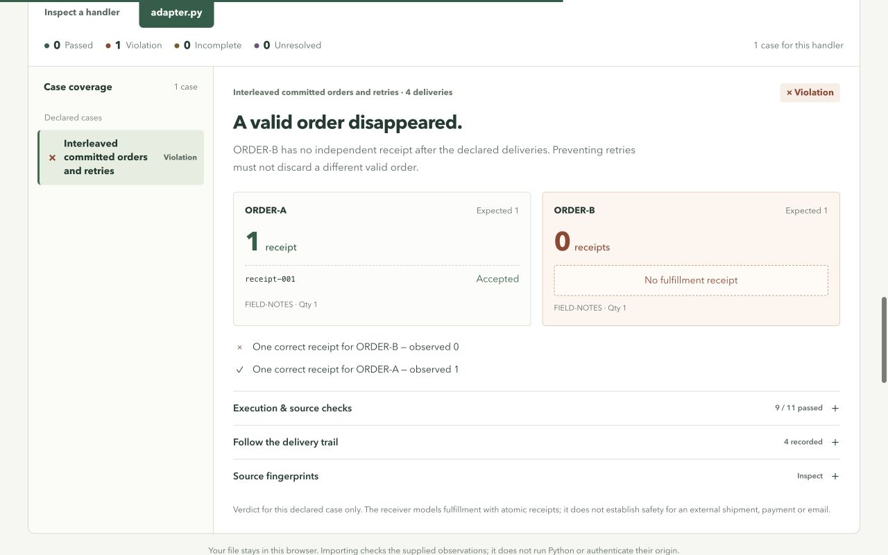

# ReplayGuard

**A retry repair should protect every order.**

[Live lab](https://prod.d2w687q4ucx6dk.amplifyapp.com) · [AWS comparison](https://prod.d2w687q4ucx6dk.amplifyapp.com/aws-key-scope.html) · [Download the regression kit](web/replayguard-repair-lab.zip) · [Earlier narrated demo](https://youtu.be/CGE19upS66A)

A worker fulfills an order, crashes, and retries. Adding an idempotency key can stop the duplicate—but a key that is too broad can also reject the next legitimate order. ReplayGuard checks both outcomes: **one correct receipt for each valid business order**.

The project began with a real Lambda/SQS failure-and-repair experiment on September 18, 2026. It now includes a three-key AWS comparison and a local bench for trusted Python adapters. Both model fulfillment as a receipt and independently check each valid order. The local bench injects a post-commit response failure and exports the inputs, fault conditions, assertions, receipts and source fingerprints as a runnable regression.



In the interleaved-retries case, two valid orders share a SKU. Each should have one receipt:

| Candidate | Order A receipts | Order B receipts | Result |
| --- | ---: | ---: | --- |
| No key | 2 | 2 | Violation: duplicate fulfillment |
| SKU key | 1 | 0 | Violation: a valid order is suppressed |
| Business order key | 1 | 1 | Passed for this case |

These counts come from [executed local evidence](web/repair-example.json). The handler's return value cannot supply receipt truth.

## Run, change a repair, inspect the result

Use the source folder or extract the [portable regression kit](web/replayguard-repair-lab.zip). Requires **Python 3.11+ on macOS or Linux**. The kit needs no packages, credentials, or network.

```sh
# Start with one known repair and one observed case: expected exit 0.
python3 -I -S scripts/test_repair.py \
  --candidate business-key --case crash-retry --output repaired.json
```

Now test the more subtle failure with a copy of the adapter:

```sh
mkdir -p candidate
cp repair_lab/adapters/business_key.py candidate/adapter.py
python3 -I -S scripts/test_repair.py \
  --adapter candidate/adapter.py --case interleaved-retries --output before.json
```

Expect **Passed**, with one receipt for each order. In `candidate/adapter.py`, change `key=order["orderId"]` to `key=order["sku"]`, then run the same case with `--output broken.json`. Expect **Violation**: ORDER-A has one receipt and valid ORDER-B has none. Restore the copied source and rerun with `--output restored.json`: both orders have one receipt again. Import those actual files into the lab to inspect the change. See the [step-by-step runbook](docs/repair-lab/runbook.md) and [actual clean-kit execution evidence](docs/repair-lab/key-scope-tutorial/README.md).

To inspect every candidate and deliberate evidence-limit control:

```sh
python3 -I -S scripts/test_repair.py --output repair-results.json
```

The full comparison intentionally exits **3**: it contains an unsupported-effect control, faulty candidates and a missing-observation control. This is the aggregate business result, not a claim that every expected test outcome should be green. The business-key candidate passes all six supported, observed reference cases.

| Exit | State | Meaning |
| --- | --- | --- |
| `0` | Passed | Required effects and delivery outcomes held for the declared case. |
| `1` | Violation | An observed business invariant or required rejection was broken. |
| `2` | Incomplete | Required execution, observation, or fault evidence is missing. |
| `3` | Unresolved | The effect contract is unsupported or a local guard boundary was crossed. |

Aggregate precedence is unresolved, violation, incomplete, passed. A missing snapshot is unknown, never an empty ledger.

Start the comparison locally:

```sh
python3 -m http.server 8088 --bind 127.0.0.1 --directory web
```

Open [127.0.0.1:8088](http://127.0.0.1:8088), select a case, inspect each candidate's receipts and delivery trace, then import your generated report. The new [index page](web/index.html) is the repair bench; [recorded-lab.html](web/recorded-lab.html) preserves the original comparison. The browser recomputes results from inputs and observations, rejects contradictory claims, and preserves the original imported bytes. It does not execute Python or authenticate report origin.

## Connect your own worker

Keep the adapter and any sibling Python source in a dedicated small directory. Export `build(effects)`, returning a callable handler:

```python
def build(effects):
    def handle(delivery):
        order = delivery["order"]
        return effects.fulfill(order, key=order["orderId"])
    return handle
```

The harness supplies deliveries and faults; the adapter chooses its key. The receiver atomically commits or reuses a receipt and rejects a conflicting payload. The fault occurs immediately after a new receipt commits, before the fulfillment response returns. Expected inputs, finite delivery schedules, assertions, receipt evidence, and captured source hashes travel in the report. See the [adapter contract](docs/repair-lab/adapter.md) and [schema](docs/repair-lab/schema.md).

Run the independent DispatchDesk example from this source repository:

```sh
python3 -I -S scripts/test_repair.py \
  --adapter examples/dispatchdesk/adapter.py \
  --case-file tests/repair_holdout/dispatchdesk-plan.json \
  --output dispatchdesk-results.json
```

Inside the extracted kit, the same plan is packaged at **`examples/dispatchdesk/cases.json`**; use that path for `--case-file`. Both commands execute application code through the same public adapter API.

Only run trusted adapters. The local guard blocks ordinary socket, AWS SDK, child-process, and ctypes paths; it is not a hostile-code sandbox. The runner bounds source size, runtime, deliveries, and effect calls. A receipt is the entire simulated fulfillment effect. Local tests do not reproduce AWS queue timing or durability, certify a third-party payment/shipping API, or prove every possible interleaving.

## Evidence behind the repair bench

A separate AI agent in this project authored a synthetic application and froze **five scenarios / 18 deliveries** before reading the engine implementation. The engine author did not inspect the frozen scenario files before their first execution. The reference passed all five; removing its key caused violations in all five, while a SKU-only key failed the two multi-order cases. The first run passed **44 integrity and execution checks**, not 44 scenarios. The final run passed **45 checks**, adding runtime-source stability. This is synthetic application evidence, not customer validation or adoption.

The final September 20 [clean-source validation](docs/releases/2026-09-20-source-validation.json) passed **149 Python tests and 112 JavaScript tests**, plus 45 transfer checks and 19 release checks, with network access denied. Its 676 repository source files match published commit `0d0ec11ef4e3ba30ad03f2bd623f4e116d7ce664`; subsequent documentation updates are separate from that tested source. Earlier, nine native edge reports passed 70 native/browser parity checks, including wrong payloads, repeated reuse, timeouts and JSON numeric equality. The [results and limits](docs/repair-lab/results.md) retain that dated evidence. Hosted CI remains **incomplete because GitHub prevented its runner from starting**, as recorded in [publication status](docs/publication-status.md#verification-status). The [new clean-kit tutorial](docs/repair-lab/key-scope-tutorial/README.md) executes the same two-order case with order-ID, SKU and restored order-ID keys: **1/1 → 1/0 → 1/1 receipts**. The earlier [no-key tutorial](docs/repair-lab/validation/README.md) is retained separately.

## The two-order AWS comparison

The final September 20 run (September 19, 19:36 UTC) observed **2/2 receipts without a key, 1/0 with a SKU key, and 1/1 with an order key**. All **22 experiment checks** passed; the two faulty handlers remain business violations. The exact experimental stack reached `DELETE_COMPLETE`, independently of the Amplify host.

This version commits a DynamoDB receipt and then fails the provider response before success returns. The worker fails, and standard SQS redelivers its message. An observer separately queries the receipt ledger and correlates the fault, worker invocation and retry. The six-message experiment sends each candidate's ORDER-A first, waits for its commit/failure evidence, then sends the different ORDER-B sharing its SKU. It does not assume a total AWS execution order or exactly two deliveries.

Open the [recorded AWS comparison](https://prod.d2w687q4ucx6dk.amplifyapp.com/aws-key-scope.html), inspect the [raw report](web/aws-key-scope-report.json), or extract the [runnable AWS regression](web/aws-key-scope-regression.zip). From that extracted archive:

```sh
python3 scripts/verify_key_case.py evidence.json --case case.json --json
shasum -a 256 -c SHA256SUMS
```

The archive's README includes a private, bounded redeployment and cleanup workflow. Offline verification needs no AWS credentials. A fresh AWS replay creates billable resources and requires an authorized profile. This is simulated fulfillment and a function/response failure; it is not an OS process-kill test or a guarantee for external payments or shipments.

The [release record](docs/releases/2026-09-20.md) retains the first failed run, the subsequent successful run, two verifier audit fixes and the final fresh observation. Earlier evidence is never rewritten to claim a later result.

## The original AWS experiment

On **September 18, 2026**, standard SQS redelivered each test message to a Lambda worker. A separate fulfillment Lambda wrote durable DynamoDB receipts; an independent observer queried the ledger and correlated CloudWatch evidence. The vulnerable path produced **two receipts**, the repaired path **one**. The recorded run satisfied **16 assertions**. Its initial cold-start failure remains preserved separately.

Inspect the [dated AWS run](web/aws-run.html), [original validation](docs/validation.md), and [unchanged AWS regression archive](web/regression-case.zip). The original worker crashed after receiving a successful fulfillment response; the new local harness also exercises response loss immediately after commit. The two evidence sets remain separate.

CloudFormation deployment and teardown sources remain available for reproducibility. Both original task-owned stacks reached `DELETE_COMPLETE` at **2026-09-18 19:13:43 UTC**. The separately versioned September 20 key-scope experiments and their cleanup records are documented in the [release evidence](docs/releases/2026-09-20.md).

## Delivery status and deadline

Source: [sudo-anshul/replayguard](https://github.com/sudo-anshul/replayguard). Publication resumed on **September 19, 2026**. The public tree was prepared from an audited source snapshot and starts with a new commit dated when it was actually published. The accepted interface and new AWS comparison are live in the [static lab](https://prod.d2w687q4ucx6dk.amplifyapp.com) on AWS Amplify. Deployment 4 passed anonymous verification of the root and all 37 staged assets, plus live interaction and mobile-layout checks. The [earlier narrated demo](https://youtu.be/CGE19upS66A) remains unlisted on YouTube. [Publication status](docs/publication-status.md) records the current release and event submission state.

AWS work is authorized within a **US$25 cumulative gross project ceiling, with US$5 kept in reserve**. The September 20 preflight observed approximately **$0.3537 estimated gross cost for September 17–19**, before credits/refunds. The new finite experiments have an allocation of at most **$2** within the remaining working envelope, with allowance for billing lag and hosting. These are operating limits, not AWS-enforced hard billing caps. Each experiment uses six original messages, a bounded collector and automatic teardown; there is no public execution endpoint. The local repair bench makes no AWS calls. See [public operating limits](docs/repair-lab/results.md#aws-evidence-and-present-limits).

Use **September 20, 2026, 09:00 IST (03:30 UTC)** as the earliest observed official cutoff. The form configuration and event countdown disagree, so the exact organizer-approved cutoff remains **unresolved**. The [deadline evidence](docs/deadline.md) and [submission package](docs/submission.md) explain the requirements and incomplete fields.

## Earlier narrated demo

The earlier repair-bench demo is **2:43 (163.033333 seconds)**, with Neha's synthetic English narration in an Indian accent. Its interface and code-edit example predate this release. Its 19 technical checks and nine-frame review are historical validation. [Watch the earlier video](https://youtu.be/CGE19upS66A) or inspect its [production evidence](docs/repair-lab/media/revision-2/README.md). The September 20 replacement is a **2:34 silent local MP4**, with animated explanations and actual captured code-edit, execution and report-inspection actions. It passed full decode, all 14 technical checks and sampled visual review; it contains no audio stream and was not uploaded to YouTube. Its [rendering source](demo/silent-20260920/README.md) and [release record](docs/releases/2026-09-20.md) document its evidence, editorial holds and reproducibility limits.

Built with OpenAI Codex for research, implementation, testing, UI, and demo preparation. The developer remains responsible for review and submission. MIT licensed.
