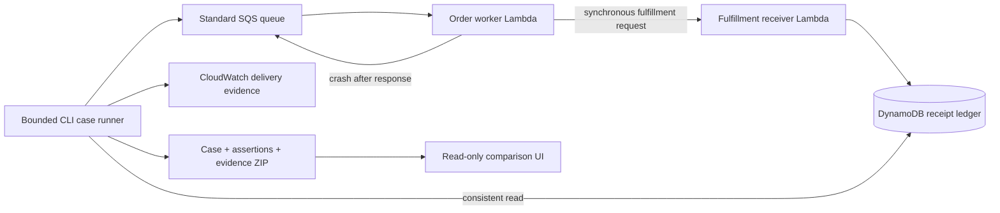

# Recorded AWS lab design: a receipt is the source of truth

This document describes the **September 18, 2026 AWS experiment**. Both task-owned stacks were subsequently deleted. The current local adapter runner is documented in the [repair contract](repair-lab/adapter.md); [current results and operating limits](repair-lab/results.md) remain separate from this historical design.

ReplayGuard is a focused failure lab for an SQS order worker. Its only simulated business action is writing a fulfillment receipt in a separate receiver Lambda. There are no real orders, payments, emails or shipments.

The worker role cannot write or read the receipt ledger. The observer queries that ledger directly, then correlates records with the exact message IDs returned by SQS and Lambda request IDs in CloudWatch. A worker's `completed` log cannot substitute for a receipt.

The vulnerable handler sends fulfillment without an idempotency key. When its first delivery crashes after the receiver returns a durable receipt, SQS redelivers the same message. A second receipt exposes the duplicate. The repaired handler sends a stable key derived from run ID and order ID. The receiver atomically creates one receipt under that key and returns it for an identical retry; changed inputs under the key are rejected. Both modes see the same order and injected failure.

This repair depends on the receiver owning the atomic side effect. A worker-side 'processed' flag written before or after an external shipment would leave a crash gap. This lab does not claim exactly-once delivery or solve idempotency for an external service that cannot enforce a key. The receipt itself is the simulated fulfillment; no additional side effect is hidden behind the write.

## Evidence states

- **Passed:** the baseline duplicate was detected and the repaired comparison met every required assertion, including actual redelivery, fault placement and bounded queue observation.
- **Incomplete:** required data is missing, AWS access failed, the deadline elapsed, or observation has not finished. No success is inferred from an empty ledger.
- **Unresolved:** observed facts contradict an assertion, such as multiple repaired receipts or inconsistent inputs. Inspect the evidence; do not present this as repaired.

A finite observation window cannot prove that no duplicate will ever arrive. Exported evidence describes the measured run and its limits. CloudWatch may be delayed; that can yield incomplete evidence even when the order eventually finishes. Re-run the case with a new run ID after correcting the cause.

## Infrastructure and operating limits

The experiment used one standard queue, one DLQ, two Python Lambdas, one DynamoDB table and explicit short-retention log groups. It used no VPC, NAT gateway, API Gateway, database cluster, container service or public execution endpoint. The hosting template targeted AWS Amplify, but no content deployment succeeded. That original app was deleted. See [current publication status](publication-status.md) for the subsequent hosting release.

Each runner invocation validates at most three synthetic orders and sends at most six messages. Lambda concurrency, short function timeouts, SQS redrive and capped DynamoDB throughput limit throughput. The default lab accepts work for 24 hours; deployment can select 1–48 hours. That expiry rejects new fulfillment; it does not delete resources. DynamoDB TTL is eventual cleanup, not immediate deletion.

The original design targeted small finite runs; this did not impose a hard billing cap. AWS billing depends on regional rates, traffic and account allowances. Queue polling and retained resources can continue to cost money. Both task-owned stacks reached `DELETE_COMPLETE` on September 18 at 19:13:43 UTC. Publication and hosting resumed on September 19 with a **US$25 cumulative gross project ceiling and US$5 reserve**. Further billable work requires confirmed gross-spend headroom. Retained deployment and teardown scripts make the lab reproducible; the public UI does not execute them.
